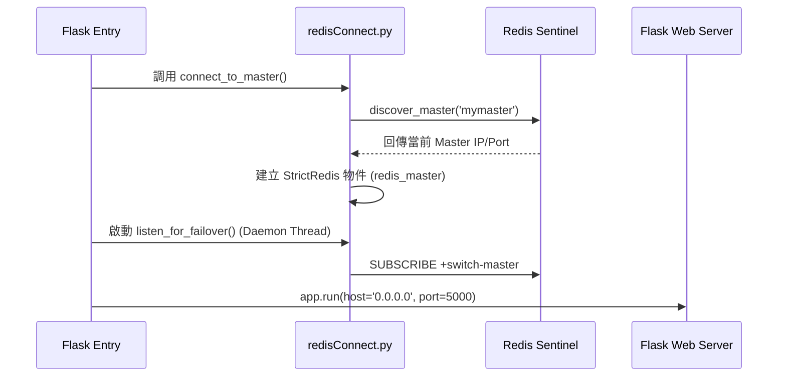
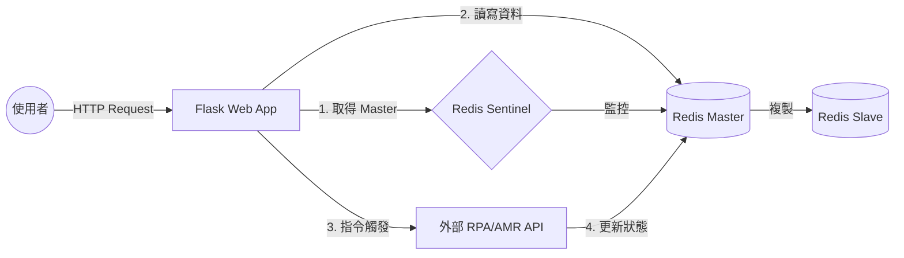

# Redis 佇列管理系統 - 開發者技術文件

本專案是一個基於 **Python Flask** 開發的 Redis 監控與管理平台，專為具備 **High Availability (HA)** 需求的生產環境設計。系統核心整合了 **Redis Sentinel** 故障轉移機制，確保在 Redis 主從切換時，Web 應用程式能動態重連。

---

## 技術棧 (Tech Stack)

- **Backend**: Python 3.9+ / Flask 2.0.1
- **Storage**: Redis (Master-Slave Replication) + Redis Sentinel (HA)
- **Frontend**: Jinja2, Tailwind CSS, Chart.js, FontAwesome 6
- **Deployment**: Docker, Docker Compose
- **Tooling**: `requests` (API 觸發), `redis-py` (Sentinel 整合)

---

## 專案結構 (Project Structure)

```text
RedisSever/
├── read_queue.py           # 核心 Web 應用程式 (Flask Entry Point)
├── redisConnect.py         # Redis Sentinel 連線與故障轉移邏輯
├── conf.json               # 外部 Worker API 節點配置
├── .env                    # 環境變數 (Secrets & Config)
├── docker-compose.yaml      # 全系統編排 (Web + Redis + Sentinel)
├── Dockerfile.web          # Web 服務鏡像定義
├── Dockerfile.sentinel     # Sentinel 服務鏡像定義
├── static/                 # 靜態資源 (CSS/JS/Fonts)
├── templates/              # HTML 樣板 (Jinja2)
└── deps/                   # 本地依賴套件 (供離線環境安裝)
```

---

## 系統架構與流程 (System Architecture)

### 啟動順序 (Startup Process)
系統遵循以下初始化順序，確保資料庫連線優先於 Web 服務：



### 資料流圖 (Data Flow)


---

## 核心機制：故障轉移 (Failover Logic)

當 Redis Master 故障時，系統會自動執行以下流程：

1.  **偵測與選主**：Sentinel 叢集偵測到故障並自動將其中一個 Slave 提升為 Master。
2.  **事件廣播**：Sentinel 發布 `+switch-master` 事件，包含新舊節點的 IP 與 Port。
3.  **App 回應**：`listen_for_failover` 執行緒接收事件後，解析新 Master 資訊。
4.  **動態重連**：調用 `connect_to_master()` 更新全域 `redis_master` 物件。隨後的 Flask 請求將自動導向新節點，無需重新啟動容器。

---

## 功能頁面說明 (Feature Guide)

### 1. 監控儀表板 (Monitoring)
- **主頁 (Redis 檢視器)**：
    - 讀取 `ALLOWED_QUEUES` 中的 Key，支援 `List` 與 `Hash` 型別。
    - **過濾機制**：自動過濾 `{"task_id": "__INIT__"}` 控制項。
    - **Hash 概覽**：僅顯示 `status` 欄位，完整內容可透過「下載 JSON」取得。
- **任務趨勢圖 (Queue History)**：
    - 基於 Chart.js，支援 AJAX 自動刷新（每 5 秒）。
    - 監控任務類別（如 `LotActions`）的成功與失敗率趨勢。
- **Worker 狀態與佇列長度**：
    - **Worker Status**：網格化呈現各節點即時連線狀態。
    - **Queue Lengths**：依前綴分組，協助快速定位堆積任務。

### 2. 資料維護與操作 (Data & Operations)
- **設備管理 (Equipments)**：
    - **儲存結構**：Redis Hash `equipments`，以 `EQPID` 為 Key。
    - **欄位規範**：
        - **必填 (Mandatory)**：`EQPID` (Key), `EQPTYPE`, `TESTERIP`, `PROBERIP`, `LINEGROUP`, `floor`, `Action`。
        - **說明**：為確保外部 API 觸發時能正確取得機台 IP 與動作參數，上述欄位**皆不可留空**。
    - **功能**：支援欄位篩選與 CRUD 操作。
- **聯絡人管理 (Contacts)**：
    - **儲存結構**：Redis Hash `contacts`，Key 為系統自動產生的唯一序號。
    - **欄位規範**：
        - **系統產生**：ID (透過 `contacts_id_counter` 自動自增)。
        - **必填 (Mandatory)**：`EQPID`, `EQPTYPE`, `Action`, `LINEGROUP`, `floor`。
    - **功能**：用於管理各機台對應的 Line 群組通知對象。
- **AMR API 觸發器 (API Trigger)**：
    - **用途**：提供工程人員手動干預或測試外部 AMR/EQP 系統 API 的介面。
    - **支援端點 (Endpoints)**：
        - `/EQPAction`：發送標準機台動作（如 `LotStart`, `LotEnd`）。
        - `/EQPAction_DataEntry`：支援額外輸入欄位（`TesterInput`, `ProberInput`, `Mode`）。
        - `/Prober`：Prober 專用控制指令。
        - `/ContactInquiry`：使用 **GET** 請求查詢聯絡人資訊。
    - **動態 UI**：前端會根據選取的端點自動切換顯示對應的輸入欄位。
    - **回應顯示**：即時呈現 API 的 `Status Code`, `Reason` 與完整的 `JSON Content`。
- **腳本更新 (Script Update)**：依據 `conf.json` 向 RPA 節點發送批次更新指令。

---

## 權限與角色控制 (RBAC)

| 功能 / 頁面 | `admin` (管理員) | `viewer` (檢視者) |
| :--- | :---: | :---: |
| 檢視佇列/雜湊表 / 下載 JSON | ✅ | ✅ |
| 查看儀表板 (History, Status) | ✅ | ✅ |
| API 測試觸發 (AMR) | ✅ | ✅ |
| 編輯/刪除/清空佇列資料 | ✅ | ❌ |
| 編輯 Equipments & Contacts | ✅ | ❌ |
| 觸發 Script Update | ✅ | ❌ |
| 使用者管理 (註冊/刪除) | ✅ | ❌ |

---

## 資料結構 (Schema)

### 1. 使用者認證 (`users`)
- **Type**: Hash | **Value**: `hash_str:role`

### 2. 設備資料 (`equipments`)
- **Value (JSON)**: `{"EQPTYPE": "...", "TESTERIP": "...", "floor": "...", ...}`

### 3. 歷史紀錄 (`queue_history:*`)
- **Type**: List | **Format**: JSON String (含 `task_id`, `timestamp`, `status`)

---

## API Contract (API 規範)

### 外部 API 呼叫格式
- **Target**: `http://<worker_ip>:8000/EQPAction`
- **Headers**: `X-API-KEY: <key>`, `Content-Type: application/json`
- **Payload**:
  ```json
  {
    "projectID": "86HklPenDDAsPmtc",
    "taskID": "KT59-m35TfGliLDH",
    "args": ["source_path", "target_path"]
  }
  ```

---

## 部署與環境配置

### 環境變數 (.env)
- `FLASK_SECRET_KEY`: Session 加密金鑰。
- `REDIS_SENTINELS`: Sentinel 節點清單 (例如 `sentinel1:26379,sentinel2:26379`)。
- `ALLOWED_QUEUES`: 前端可操作的 Redis Key 清單。

### 本地開發
1. 建立虛擬環境並安裝 `requirements.txt`。
2. 使用 `docker-compose up -d` 啟動 Redis 基礎設施。
3. 執行 `python read_queue.py` 啟動 Web 服務。

---

## Docker 服務編排
- **架構**：1 主、2 從、3 Sentinel。
- **Quorum**：設定為 2，確保在多數決下進行選主。

---

